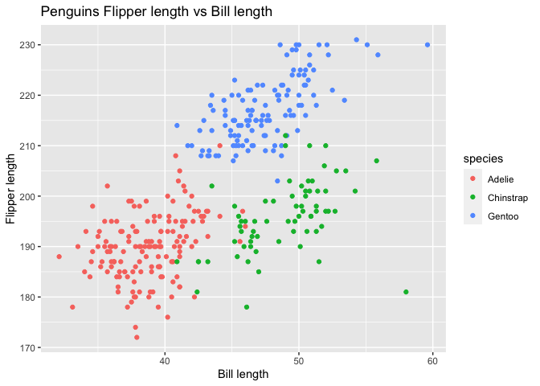

p8105\_hw1\_zh2494
================
zhuolun
9/23/2021

# problem 1

-   create the data frame

``` r
problem_1_df = tibble(
  vec_numeric = rnorm(n = 10), # a random sample of size 10 from a standard normal distrbution
  vec_logical = vec_numeric > 0, # a logical vector indicating whether elements of the sample are greater than 0
  vec_char = c("a","b","c","d","e","f","g","h","I","g"), # a character vector of length 10
  vec_factor = factor(c("high","low","median","high","low","median","high","low","median","high"))
) # a factor vector of length 10, with 3 different factor “levels”

# problem_1 data frame
problem_1_df 
```

    ## # A tibble: 10 × 4
    ##    vec_numeric vec_logical vec_char vec_factor
    ##          <dbl> <lgl>       <chr>    <fct>     
    ##  1     -0.179  FALSE       a        high      
    ##  2     -2.50   FALSE       b        low       
    ##  3      2.13   TRUE        c        median    
    ##  4     -0.513  FALSE       d        high      
    ##  5      0.0196 TRUE        e        low       
    ##  6      1.03   TRUE        f        median    
    ##  7     -0.877  FALSE       g        high      
    ##  8      0.362  TRUE        h        low       
    ##  9      0.202  TRUE        I        median    
    ## 10     -1.73   FALSE       g        high

-   take the mean of each variables

``` r
#  a random sample of size 10 from a standard Normal distribution
mean_numeric = mean(pull(problem_1_df, vec_numeric))
mean_numeric
```

    ## [1] -0.2059466

``` r
# a logical vector indicating whether elements of the sample are greater than 0
mean_logical = mean(pull(problem_1_df, vec_logical))
mean_logical
```

    ## [1] 0.5

``` r
# a character vector of length 10
mean_char = mean(pull(problem_1_df, vec_char))
```

    ## Warning in mean.default(pull(problem_1_df, vec_char)): argument is not numeric
    ## or logical: returning NA

``` r
mean_char
```

    ## [1] NA

``` r
# a factor vector of length 10, with 3 different factor “levels”
mean_factor = mean(pull(problem_1_df, vec_factor))
```

    ## Warning in mean.default(pull(problem_1_df, vec_factor)): argument is not numeric
    ## or logical: returning NA

``` r
mean_factor
```

    ## [1] NA

**The mean of the numeric number is -0.2059466.** **The mean of the
mean\_logical is 0.5.** **The mean of the character is NA,taking the
mean does not work and will return NA** **The mean of the factor number
is NA,taking the mean does not work and will return NA**

-   Add \``as.numeric` function to logical,character and factor
    variables

``` r
# add as.numeric to nordist_sam
as.numeric(pull(problem_1_df ,vec_numeric))
# add as.numeric to sam_greater0
as.numeric(pull(problem_1_df ,vec_logical))
# add as.numeric to chara_10
as.numeric(pull(problem_1_df ,vec_char))
```

    ## Warning: NAs introduced by coercion

``` r
# add as.numeric to fact_10
as.numeric(pull(problem_1_df ,vec_factor))
```

**`as.numeric` is applied to logical variable and numeric variable.**
**but it can not be used for character and factor variable.** **This the
reason why the logical variable and numeric variable can be**
**converted but the factor and character can not be converted and can
not be calculated as well.**

# problem 2

``` r
# install.packages("palmerpenguins")
# load penguins dataset 
data("penguins", package = "palmerpenguins")

# show the overall of the penguins
skimr::skim(penguins)
```

|                                                  |          |
|:-------------------------------------------------|:---------|
| Name                                             | penguins |
| Number of rows                                   | 344      |
| Number of columns                                | 8        |
| \_\_\_\_\_\_\_\_\_\_\_\_\_\_\_\_\_\_\_\_\_\_\_   |          |
| Column type frequency:                           |          |
| factor                                           | 3        |
| numeric                                          | 5        |
| \_\_\_\_\_\_\_\_\_\_\_\_\_\_\_\_\_\_\_\_\_\_\_\_ |          |
| Group variables                                  | None     |

Data summary

**Variable type: factor**

| skim\_variable | n\_missing | complete\_rate | ordered | n\_unique | top\_counts                 |
|:---------------|-----------:|---------------:|:--------|----------:|:----------------------------|
| species        |          0 |           1.00 | FALSE   |         3 | Ade: 152, Gen: 124, Chi: 68 |
| island         |          0 |           1.00 | FALSE   |         3 | Bis: 168, Dre: 124, Tor: 52 |
| sex            |         11 |           0.97 | FALSE   |         2 | mal: 168, fem: 165          |

**Variable type: numeric**

| skim\_variable      | n\_missing | complete\_rate |    mean |     sd |     p0 |     p25 |     p50 |    p75 |   p100 | hist  |
|:--------------------|-----------:|---------------:|--------:|-------:|-------:|--------:|--------:|-------:|-------:|:------|
| bill\_length\_mm    |          2 |           0.99 |   43.92 |   5.46 |   32.1 |   39.23 |   44.45 |   48.5 |   59.6 | ▃▇▇▆▁ |
| bill\_depth\_mm     |          2 |           0.99 |   17.15 |   1.97 |   13.1 |   15.60 |   17.30 |   18.7 |   21.5 | ▅▅▇▇▂ |
| flipper\_length\_mm |          2 |           0.99 |  200.92 |  14.06 |  172.0 |  190.00 |  197.00 |  213.0 |  231.0 | ▂▇▃▅▂ |
| body\_mass\_g       |          2 |           0.99 | 4201.75 | 801.95 | 2700.0 | 3550.00 | 4050.00 | 4750.0 | 6300.0 | ▃▇▆▃▂ |
| year                |          0 |           1.00 | 2008.03 |   0.82 | 2007.0 | 2007.00 | 2008.00 | 2009.0 | 2009.0 | ▇▁▇▁▇ |

``` r
#the data in this dataset, including names/values of important variables. 
head(penguins)
```

    ## # A tibble: 6 × 8
    ##   species island bill_length_mm bill_depth_mm flipper_length_… body_mass_g sex  
    ##   <fct>   <fct>           <dbl>         <dbl>            <int>       <int> <fct>
    ## 1 Adelie  Torge…           39.1          18.7              181        3750 male 
    ## 2 Adelie  Torge…           39.5          17.4              186        3800 fema…
    ## 3 Adelie  Torge…           40.3          18                195        3250 fema…
    ## 4 Adelie  Torge…           NA            NA                 NA          NA <NA> 
    ## 5 Adelie  Torge…           36.7          19.3              193        3450 fema…
    ## 6 Adelie  Torge…           39.3          20.6              190        3650 male 
    ## # … with 1 more variable: year <int>

**The variables of the penguins are species, island, bill\_length\_mm,
bill\_depth\_mm, flipper\_length\_mm, body\_mass\_g, sex, year.** **The
data frame penguins has 344 rows.** **The data frame penguins has 8
columns.** **the species of this dataset, there are 3 categories, which
are Adelie, Gentoo, Chinstrap.** **The island of this dataset, there are
3 categories, which are Torgersen, Biscoe, Dream.** **The bill length
(mm) starts from 32.1 to 59.6 with mean equals to 43.9219298.** **The
bill depth (mm) starts from 13.1 to 21.5 with mean equals to
17.1511696.** **The flipper length (mm) starts from 172 to 231 with mean
equals to 200.9152047.** **The body mass (g) starts from 2700 to 6300
with mean equals to 4201.754386.**

-   make the scatterplot

``` r
ggplot(penguins, aes(x = bill_length_mm, y = flipper_length_mm, color = species)) +
  geom_point() + 
  ggtitle("Penguins Flipper length vs Bill length") + 
  ylab("Flipper length") +
  xlab("Bill length")
```

    ## Warning: Removed 2 rows containing missing values (geom_point).

<!-- -->

``` r
#save the plot
ggsave("scatter_plot.jpeg", height = 4, width = 4)
```

    ## Warning: Removed 2 rows containing missing values (geom_point).
