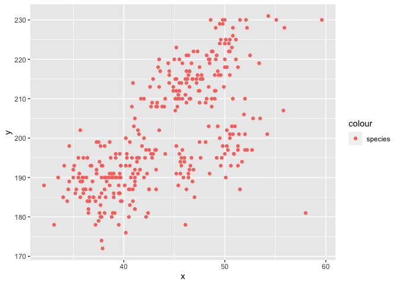

p8105\_hw1\_zh2494
================
zhuolun
9/23/2021

# section 1

``` r
library(tidyverse)
```

# section 2

``` r
problem_1_df = tibble(
  vec_numeric = rnorm(n = 10),
  vec_logical = vec_numeric > 0,
  vec_char = c("a","b","c","d","e","f","g","h","I","g"),
  vec_factor = factor(c("high","low","median","high","low","median","high","low","median","high"))
)
problem_1_df
```

    ## # A tibble: 10 × 4
    ##    vec_numeric vec_logical vec_char vec_factor
    ##          <dbl> <lgl>       <chr>    <fct>     
    ##  1     1.32    TRUE        a        high      
    ##  2    -1.06    FALSE       b        low       
    ##  3    -0.116   FALSE       c        median    
    ##  4     0.00588 TRUE        d        high      
    ##  5     1.86    TRUE        e        low       
    ##  6    -1.30    FALSE       f        median    
    ##  7     0.269   TRUE        g        high      
    ##  8     0.198   TRUE        h        low       
    ##  9     2.62    TRUE        I        median    
    ## 10    -1.31    FALSE       g        high

# section 3

``` r
mean_numeric = mean(pull(problem_1_df, vec_numeric))
mean_logical = mean(as.numeric(pull(problem_1_df, vec_logical)))
mean_char = mean(as.numeric(pull(problem_1_df, vec_char)))
```

    ## Warning in mean(as.numeric(pull(problem_1_df, vec_char))): NAs introduced by
    ## coercion

``` r
mean_factor = mean(as.numeric(pull(problem_1_df, vec_factor)))
```

The mean of the numeric number is 0.2478358 The mean of the numeric
number is 0.6 The mean of the numeric number is NA,the result is NA,
because the charater is not converted to number. The mean of the numeric
number is 1.9

# section 4

``` r
# install.packages("palmerpenguins")
data("penguins", package = "palmerpenguins")
view(penguins)
mean(as.numeric(pull(penguins,flipper_length_mm)))
```

    ## [1] NA

``` r
skimr::skim(penguins)
```

|                                                  |          |
|:-------------------------------------------------|:---------|
| Name                                             | penguins |
| Number of rows                                   | 344      |
| Number of columns                                | 8        |
| \_\_\_\_\_\_\_\_\_\_\_\_\_\_\_\_\_\_\_\_\_\_\_   |          |
| Column type frequency:                           |          |
| factor                                           | 3        |
| numeric                                          | 5        |
| \_\_\_\_\_\_\_\_\_\_\_\_\_\_\_\_\_\_\_\_\_\_\_\_ |          |
| Group variables                                  | None     |

Data summary

**Variable type: factor**

| skim\_variable | n\_missing | complete\_rate | ordered | n\_unique | top\_counts                 |
|:---------------|-----------:|---------------:|:--------|----------:|:----------------------------|
| species        |          0 |           1.00 | FALSE   |         3 | Ade: 152, Gen: 124, Chi: 68 |
| island         |          0 |           1.00 | FALSE   |         3 | Bis: 168, Dre: 124, Tor: 52 |
| sex            |         11 |           0.97 | FALSE   |         2 | mal: 168, fem: 165          |

**Variable type: numeric**

| skim\_variable      | n\_missing | complete\_rate |    mean |     sd |     p0 |     p25 |     p50 |    p75 |   p100 | hist  |
|:--------------------|-----------:|---------------:|--------:|-------:|-------:|--------:|--------:|-------:|-------:|:------|
| bill\_length\_mm    |          2 |           0.99 |   43.92 |   5.46 |   32.1 |   39.23 |   44.45 |   48.5 |   59.6 | ▃▇▇▆▁ |
| bill\_depth\_mm     |          2 |           0.99 |   17.15 |   1.97 |   13.1 |   15.60 |   17.30 |   18.7 |   21.5 | ▅▅▇▇▂ |
| flipper\_length\_mm |          2 |           0.99 |  200.92 |  14.06 |  172.0 |  190.00 |  197.00 |  213.0 |  231.0 | ▂▇▃▅▂ |
| body\_mass\_g       |          2 |           0.99 | 4201.75 | 801.95 | 2700.0 | 3550.00 | 4050.00 | 4750.0 | 6300.0 | ▃▇▆▃▂ |
| year                |          0 |           1.00 | 2008.03 |   0.82 | 2007.0 | 2007.00 | 2008.00 | 2009.0 | 2009.0 | ▇▁▇▁▇ |

``` r
a = as.numeric(pull(penguins,flipper_length_mm))
a1 = a[!is.na(a)]
mean(a1)
```

    ## [1] 200.9152

• The names of the penguins are species, island, bill\_length\_mm,
bill\_depth\_mm, flipper\_length\_mm, body\_mass\_g, sex, year • The
mean of the flipper length is NA • The data frame penguins has 344 rows
• The data frame penguins has 8 columns • The mean flipper length is
200.9152047

``` r
plot_df = tibble(
  x = pull(penguins,bill_length_mm),
  y = pull(penguins,flipper_length_mm)
)
ggplot(plot_df, aes(x = x,y = y,color = 'species' )) + geom_point()
```

    ## Warning: Removed 2 rows containing missing values (geom_point).

<!-- -->
